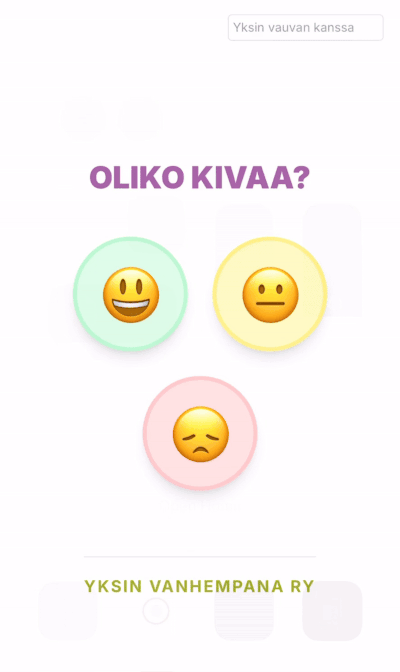

# Event Satisfaction Tracker 😃😐😞

  <table>
  <tr>
    <td width="220" valign="top">
      
    </td>
    <td valign="top">
      <p><b>A lightweight feedback collection system designed for events. This application allows participants (specifically optimized for children) to quickly rate their experience using intuitive emojis.</b></p>
      <p> <h2>🚀 Features</h2></p>
      <ul>
        <li><b>Kid-Friendly UI:</b> Simple, large, and colorful interactive emojis.</li>
        <li><b>Event-Specific Tracking:</b> Ability to set unique event names for organized data collection.</li>
        <li><b>Secure Admin Dashboard:</b> Password-protected access to real-time results.</li>
      <li><b>Data Export:</b> One-click CSV export for analysis in Excel or Google Sheets.</li>
         <li><b>Real-time Database:</b> Powered by Supabase for instant data synchronization.</li>
      </ul>
    </td>
  </tr>
</table>

## 🛠 Tech Stack

- **Framework**: [Next.js](https://nextjs.org/)
- **Styling**: [Tailwind CSS](https://tailwindcss.com/)
- **Backend/Database**: [Supabase](https://supabase.com/)
- **Deployment**: Vercel

## 📋 Setup & Installation

1. **Clone the repository**
2. **Install dependencies**: `npm install`
3. **Environment Variables**: Create a `.env.local` file with your Supabase credentials:
   ```env
   NEXT_PUBLIC_SUPABASE_URL=your_url
   NEXT_PUBLIC_SUPABASE_ANON_KEY=your_key
4. **Run development server**: npm run dev

## 🔒 Security

- **Row Level Security (RLS)**: Configured to allow public inserts while protecting read access.
- **Admin Access**: Protected by a secure access code for data privacy.

## 📄 License

This project is open-source and available under the MIT License.

---
*Created for Yksin vanhempana ry*
